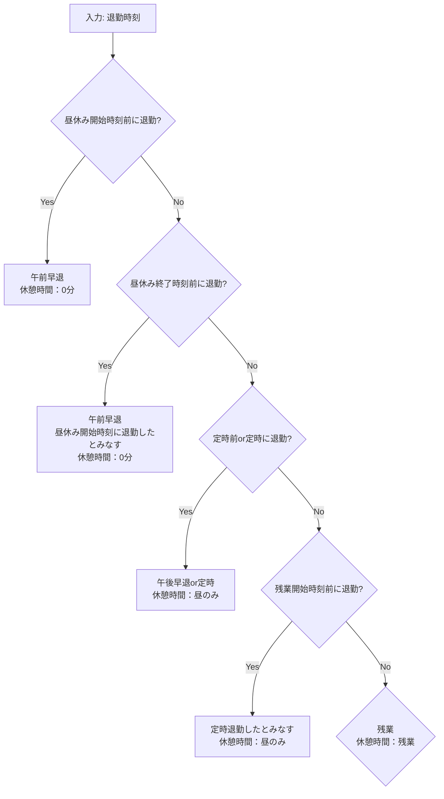
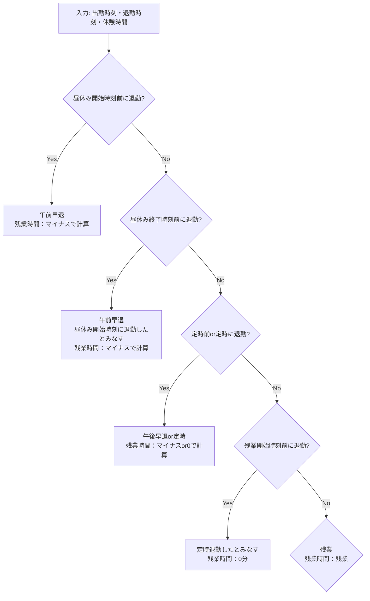

[](https://github.com/tkura37/WorkingHoursCalculator/actions/workflows/GoogleTest-CI.yml)

# 休憩時間・残業時間計算プログラム
## 概要
- 入力された出勤時間と退勤時間から、休憩時間と残業時間を計算して出力するプログラム
- 30分=0.5換算で算出したいときに便利
- フレックス勤務想定(遅刻時間の出力はしない)

## 利用技術
- C言語(メインソースコード)
- GoogleTest(単体テストコード)
- Make
- CMake
- メインプログラムのbuildおよび実行はWindows上で、単体テストはWSL上で実施

## 使い方
例）標準勤務時間が`9:00~18:00`、休憩時間が`12:00~13:00`・`18:00~18:15`の場合
1. 自身の勤務状況に合わせてマクロ定義の値を変更
   ```C:src/WorkingHoursCalculator.h
   #define STANDARD_WORK_HOURS     "8:00"  // 標準の勤務時間
   #define LUNCHBREAK_START_TIME   "12:00" // 昼休みの開始時刻
   #define LUNCHBREAK_END_TIME     "13:00" // 昼休みの終了時刻
   #define STANDARD_END_TIME       "18:00" // 定時の退勤時刻
   #define OVERTIME_START_TIME     "18:15" // 残業の開始時刻
   ```
2. ビルド(make)
   ```bash
   cd WorkingHoursCalculator
   make
   ```
3. 実行  
   第1引数に出勤時間、第2引数に退勤時間を指定
   ```bash
   ./WorkingHoursCalculator 9:00 18:00
   ```
4. 結果出力
   休憩時間と残業時間が出力される(括弧内は30分=0.5換算の値)
   ```bash
   休憩時間: 0時間45分 (0.75)
   残業時間: 0時間00分 (0.00)
   ```

## フローチャート
### 休憩時間の計算


### 残業時間の計算


## 単体テスト実行手順
```bash
cd build
cmake ..
make
./workinghours_calculator_test
```
